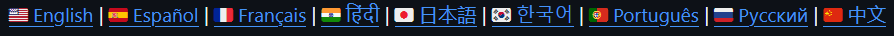
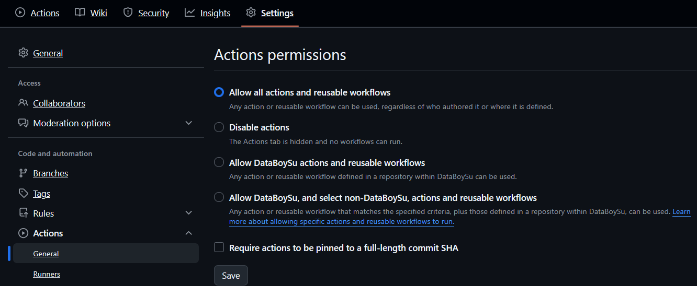

<div align="center">

<h1>
<picture>

</picture>
</h1>


[](https://github.com/DataBoySu/databoysu-readme-translator)

---

<picture>
</picture>

<p>
    <a href="https://github.com/DataBoySu/databoysu-readme-translator/issues">Report Bug</a>
    ·
    <a href="https://github.com/DataBoySu/databoysu-readme-translator/discussions/1">Request Feature</a>
</p>

</div>

This Readme Translator is a composite GitHub Action that translates a repository README and injects a language navigation bar at the top of the README.

This action runs entirely on the GitHub Runner, ensuring 100% Privacy focused and deterministic translation.

## Features

- Translate your README into 20+ languages for diverse readers with a single tool.
- Handles complex READMEs gracefully.
- Injects and updates a navbar section in your README delimited by

<a href="https://github.com/DataBoySu/waka-readme-stats">

</a>

- Uses multi-step validation approach to prevent structure breaks, hallucinations, mistranslations etc.
- Entire pipeline runs end-to-end right in your repo.
- Completely FREE and local.
- Automatic caching of the model weights and parallel execution of translation jobs for sped up translations.

---

> [!IMPORTANT]
> This translation tool is primarily meant for **public repositories** \
> Its intended execution platform is public instances of GitHub Runners
>
> While private repo owners can also run this pipeline, they should be aware that \
> an average language translation job takes 40 minutes to run
>
> So it is recommended for everyone to use the example workflow given below \
> to **parallely spin up multiple jobs** & translate everything in one go

---

## Translation Quality & Disclaimer

This automatic translator action acts as a pretty powerful **helper tool** designed to take your documentation **90-95% of the way** towards full localization.

It utilizes Qwen3-14B AI model structurally optimized through prompt engineering and regex filtering for technical content, ensuring that code blocks, tags, and jargon is preserved.

As a fail-safe, I have implemented complex post-processing which reverts document chunk back to original language(English) if it detects my set rule violations.

While the quality is high, **manual review is required for the final 5-10%**.

> [!NOTE]
> This pipeline was **not made to replace human documentation localizers** \
> but to provide them a **ready-made template** \
> to style & improve the tone and wordings as they prefer, instead of having to make such translations from scratch.

From Beginners starting out GitHub to experienced maintainers looking to create new projects, now anyone can whip up a quick multi-lingual readme by using this tool for one-click hassle-free setup.


## Supported Languages

You can use any of the following codes in the `lang` input.

| Code | Language | | Code | Language | | Code | Language |
| :--- | :--- | :--- | :--- | :--- | :--- | :--- | :--- |
| **fr** | French | | **de** | German | | **es** | Spanish |
| **ja** | Japanese | | **zh** | Chinese (Simplified) | | **ru** | Russian |
| **pt** | Portuguese | | **ko** | Korean | | **hi** | Hindi |
| **it** | Italian | | **nl** | Dutch | | **tr** | Turkish |
| **ar** | Arabic | | **vi** | Vietnamese | | **pl** | Polish |
| **uk** | Ukrainian | | **id** | Indonesian | | **cs** | Czech |
| **el** | Greek | | **he** | Hebrew | | **fa** | Persian |
| **ro** | Romanian | | **zh-tw**| Chinese (Traditional)| | | |

---
<picture>

</picture><br>

> Default: **9 languages** \
> Perfect for trial & first runs \
> Below steps need to be done only once, on future readme changes, workflow will run automatically

1. Create a file named `.github/workflows/translate.yml` in your repository and paste in it, the workflow file below.
2. Commit Changes and/or Push the changes
3. Go to `Actions` tab in your GitHub repo
4. On the left, click on `Translate Readme`
5. In the new window, click on `Run workflow`

**Optional**: add/remove codes for the languages you want translations in then click `Run workflow`

```yaml
name: Translate Readme

on:
  workflow_dispatch:
    inputs:
      languages:
        description: 'Languages to translate (comma-separated)'
        required: false
        default: 'fr,de,es,ja,zh,ru,pt,ko,hi'
  push:
    paths:
      - 'README.md'

permissions:
  contents: write

jobs:
  prepare:
    runs-on: ubuntu-latest
    outputs:
      matrix: ${{ steps.set-matrix.outputs.matrix }}
    steps:
      - id: set-matrix
        run: |
          if [ "${{ github.event_name }}" == "workflow_dispatch" ]; then
            LANGS="${{ github.event.inputs.languages }}"
          else
            LANGS="fr,de,es,ja,zh,ru,pt,ko,hi"
          fi
          # Create JSON array for matrix
          echo "matrix=$(echo $LANGS | jq -R -c 'split(",")')" >> $GITHUB_OUTPUT

  translate:
    needs: prepare
    runs-on: ubuntu-latest
    strategy:
      matrix:
        lang: ${{ fromJson(needs.prepare.outputs.matrix) }}
    steps:
      - uses: actions/checkout@v4

      - name: Run README Translator
      # Use @latest for the most up-to-date release, or @main for the bleeding edge
        uses: DataBoySu/databoysu-readme-translator@latest
        with:
          lang: ${{ matrix.lang }}

      - name: Uploading Translation Artifacts
        uses: actions/upload-artifact@v4
        with:
          name: locale-${{ matrix.lang }}
          path: locales/README.${{ matrix.lang }}.md

  commit:
    needs: translate
    runs-on: ubuntu-latest
    permissions:
      contents: write
    steps:
      - uses: actions/checkout@v4
        with:
          fetch-depth: 0
          ref: ${{ github.head_ref || github.ref_name }}
          token: ${{ secrets.GH_TOKEN || secrets.GITHUB_TOKEN }}

      - name: Pull latest changes
        run: git pull origin ${{ github.head_ref || github.ref_name }} --rebase

      - name: Download Translations
        uses: actions/download-artifact@v4
        with:
          pattern: locale-*
          path: locales
          merge-multiple: true

      - name: Navigation Bar
        uses: DataBoySu/databoysu-readme-translator@latest
        with:
          mode: navbar

      - name: Commit Changes
        uses: stefanzweifel/git-auto-commit-action@v5
        with:
          commit_message: "✨💖 docs: updated translations & navbar! 🌸✨"
          # To use your own avatar, uncomment and set your name/email:
          # commit_author: "Your Name <your-email@example.com>"
          file_pattern: 'README.md locales/*.md'
```

## Navigation Bar Behavior

The action automatically manages links between your translated files.

1. **Default**: If no navbar exists, one is **appended to the very top** of your `README.md`.
2. **Existing**: If a navbar exists, it updates the links based on the languages found in your `locales/` folder.
3. **Manual Placement**: If you want the navbar in a specific location (e.g., below a logo), add these markers to your `README.md`:

    ```markdown
    <!--START_SECTION:navbar-->
    <!--END_SECTION:navbar-->
    ```

## Token & Permissions

By default, this workflow uses the automatic `GITHUB_TOKEN` to push changes back to your repository.

<details><summary>
<strong>Permissions:</strong> You must allow actions to read/write.
</summary>
<picture>


</picture>
</details>

## License

[AGPL-3.0](LICENSE)
